# Object  
Object adalah sebuah tipe data pada variabel yang menyimpan properti dan fungsi (method).  
Properti adalah data lengkap dari sebuah object.  
Method adalah action dari sebuah object. Apa saja yang dapat dilakukan dari suatu object.  

   

### Membuat sebuah object  
Object dapat diassign kedalam sebuah variabel.  

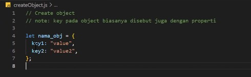  

Memisahkan properti dengan menggunakan koma.  

Properti agar memiliki spasi mengginakan string   

Di dalam object kita dapat menyimpan properti dengan tipe data apapun.

 

### Mengakses Object dan Property Object  

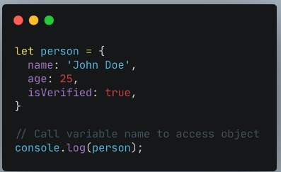   

>Mengakses seluruh object

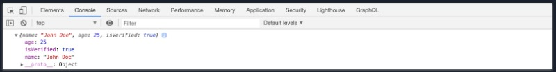  

>Data pada console log

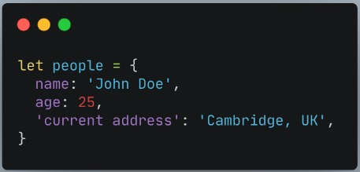   

>Gunakan single quote pada key jika menggunakan spasi seperti ‘current address’

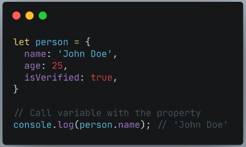  

>Mengakses properti object  

   

>Data pada console log

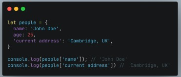   

>Kita juga bisa menggunakan bracket notation saat memanggil properti dari sebuah object.  

 

### Update Object  
* Object dapat mengupdate value dari key yang sudah tersedia  
* Object dapat menambahkan key dan value baru  

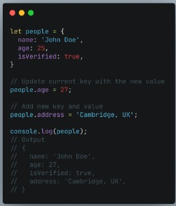 

>Update data pada Object

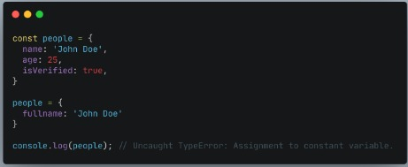  

>Jika menggunakan constant pada variable object. Kita tidak bisa mengganti seluruh data object dengan object yang baru.  

Jadi jika membutuhkan untuk update seluruh data object gunakan ‘let’ pada saat deklarasi variabel.  

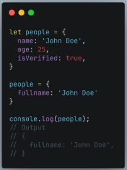  

>Update data object harus menggunakan let pada deklarasi variabel  

 

### Delete Object Property  

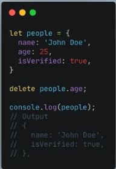   

>Delete property object age dari data people  

   

### Method  
Jika value yang kita masukkan pada property berupa function.  
Maka itu disebut method.  

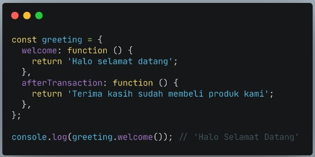   

  

### Nested Object  
Object yang kompleks

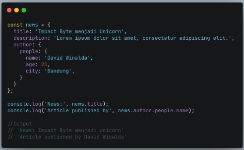  

 

### Pass by reference  
Mengubah data yang ada pada object melalui sebuah function dan memasukkan object sebagai parameter function.

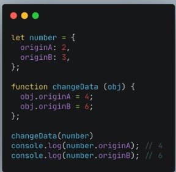   

>Kita mengubah data object number dengan sebuah function changeData  

   

### Looping Object  
Menampilkan seluruh object properti.  
Jadi tidak perlu mengakses secara manual memanggil setiap propertinya.  

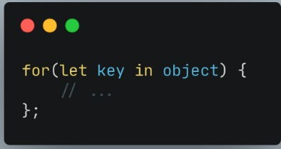 

>Looping pada object

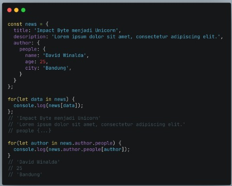   

 

### Array of Object  
Object sama seperti Array yang bisa menyimpan banyak data.  
Kita dapat menggunakan array of object untuk data yang lebih dari satu.  

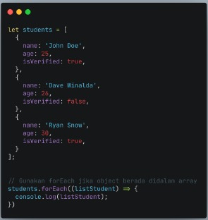  

>Looping pada Data array of object students

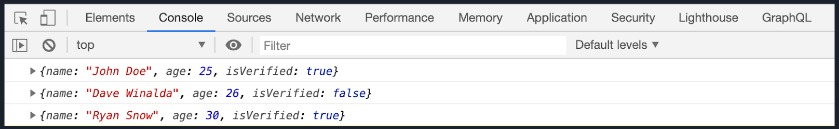  

>Hasil looping array of object pada console