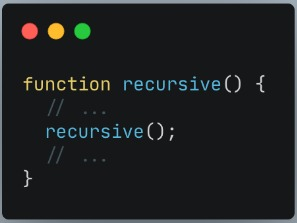
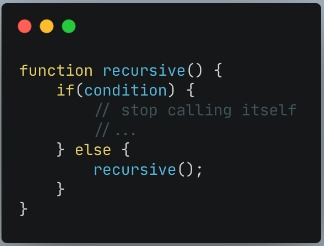
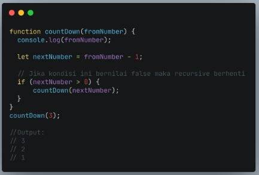
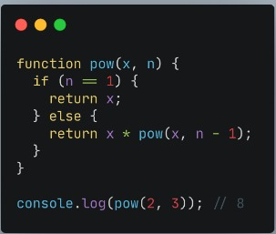

# Recursive  
Recursive adalah function yang memanggil dirinya sendiri sampai kondisi tertentu.  
Recursive kebanyakan digunakan untuk case matematika, fisika, kimia, dan yang berhubungan dengan calculation.  

   

>Struktur recursive

  

>Recursive akan berhenti memanggil dirinya sendiri jika kondisi terpenuhi  

 

A New Paradigm:  
* procedural  
* conditional  
* looping  
* modular (function)  
* recursive  

   

Ciri dari rekursif :  
* Fungsi rekursif selalu memiliki kondisi yang menyatakan kapan fungsi tersebut berhenti. Kondisi ini harus dapat dibuktikan akan tercapai, karena jika tidak tercapai maka kita tidak dapat membuktikan bahwa fungsi akan berhenti, yang berarti algoritma kita tidak benar.  
* Fungsi rekursif selalu memanggil dirinya sendiri sambil mengurangi atau memecahkan data masukan setiap panggilannya. Hal ini penting diingat, karena tujuan utama dari rekursif ialah memecahkan masalah dengan mengurangi masalah tersebut menjadi masalah-masalah kecil.  

   

***Contoh Kasus** 

  

>Fungsi rekursif menghitung mundur number

  

>Mencari hasil dari nilai pangkat dengan rekursif