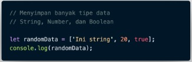
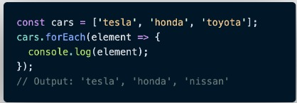

# Array  
Array adalah tipe data list order yang dapat menyimpan tipe data apapun di dalamnya.  
Array dapat menyimpan tipe data String, Number, Boolean, dan lainnya.  

Contoh Array :  

   

  

   

  

   

### Membuat Array  

  

**Mengakses/Memanggil Array**  
Array pada javascript dihitung dari index data ke-0.  
Data pertama adalah index ke-0.  

  

 

  

  

  

  

  

   

**Update Array**  

  

**Const in Array**  
* Jika menggunakan let, kita dapat mengubah array  dengan array baru dan konten nilai yang ada di dalam array dengan nilai lain.  
* Const tidak bisa melakukan update data. Namun pada Array kita dapat melakukan update konten nilai di dalam array (mutable).  
* Yang tidak bisa adalah mengubah array dengan array yang baru jika menggunakan const.  

  

  

 

**Array Properties**  
Array memiliki 5 properti yang sering digunakan yaitu constructor, length, index, input, dan prototype.  
Properties adalah fitur yang sudah disediakan oleh Javascript untuk memudahkan developer.  

  

>length akan mengembalikan nilai dari jumlah panjang data suatu array.  

   

**Array Method**  
Array memiliki method atau biasa disebut built-in methods.  
Artinya Javascript sudah memudahkan kita dengan menyediakan function/method umum yang bisa kita gunakan.  

 

**Contoh Array Built-in Methods**  

  

>.push() adalah method untuk menambahkan item  array pada urutan yang paling akhir.  

  

>.pop() adalah method yang menghapus item array index terakhir.  

  

>.shift() adalah method untuk menghapus item Array pada index pertama  

  

>.unshift() adalah method untuk menambahkan item Array pada index pertama  

 

**Looping pada Array**  
Array memiliki built in methods untuk melakukan looping yaitu .map() dan .forEach()  

  

>.forEach() adalah method untuk melakukan looping pada setiap elemen array.  

  

>.map() melakukan perulangan/looping dengan membuat array baru.  

  

  

>Kita bisa lihat bahwa .map() dan forEach() sama-sama melakukan looping dan mengembalikan nilai baru dari operasi yang dilakukan.    

>Perbedaannya adalah .forEach tidak dapat membuat Array baru dari hasil operasi yang ada dalam looping  
>Lalu dari segi performance juga sangat jauh.  

  

Jadi, gunakan .forEach() jika hanya memerlukan looping untuk menampilkan saja atau menyimpan ke database.  
Gunakan .map() jika akan melakukan operasi pada array seperti yang dapat mengubah nilai array sebelumnya.
