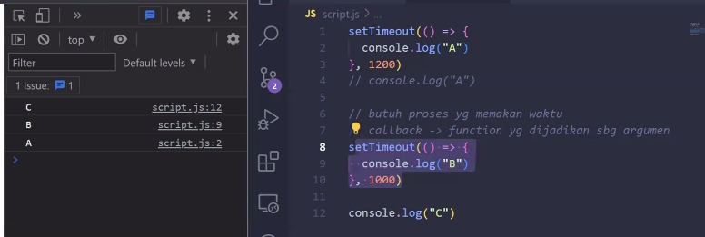
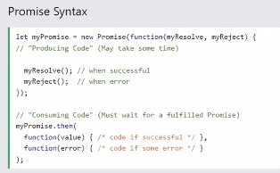

# Asycncronous  
Maksudnya adalah selama proses loading kita masih bisa scrolling.  

Bahasa pemograman Javascript :  
* JS single-thread  
* Non-Blocking  
* Asyncronous  

   

### Single Thread  

Single thread hanya punya satu jalur proses sehingga setiap proses harus saling menunggu baru lanjut ke proses lain kayak dari console.log A ke B ke C harus saling menunggu.  
Lawannya adalah multi thread atau disebut juga banyak jalur.  

  

 

### Non Blocking  
artinya kalau proses memakan waktu lama, maka dia akan mempersilahkan proses yang lain berjalan.  
Kebalikannya blocking : menghalangi. 

  

 

### Asycncronous  
Syncronus : proses biasa.  
Proses yg dilakukan secara tidak berurutan.  
Semisal A panjang banget prosesnya, jd B diekseskusi, trus lanjut lagi si A nya.  

  

>Kalau proses kepanjangan maka diselak dulu  

>a=kayak dipecah-pecah  

 

**Sifat Proses JS**  

  

Proses js tersebut disebuat dengan proses yang concurent. Yang lawan katanya multitask.  
Proses yang panjang2 dipecah-pecah sama js  

  

  

Syncronus konteknya urutan. Berarti dia dikerjakan berurutan.  
Sedangkan asyncronus konteksnya tidak terurut  

 

#### Cara menghandle asynchronus  
* callback  
* promises  
* async await  

   

  

>proses yg lama akan masuk ke callback queue  

Contoh :  

  

 

Set time out : untuk menjalankan proses selama 1 detik  

   

  

>Dalam kasus ini meskipun B 0 set time nya tetapi dia akan masuk dlu call back queue, maka dia eksekusi C nya dulu.  

**Promises**  
Promises mempersentasekan dr kjadian, apakah kejadin berhasil atau gagal dr proses asyncronus.  

  

Contoh :  

  

  

>eksekusi proses  

  

>hasil di console  

 

Contoh lain tanpa set time  

    

  

>Teks  akan masuk ke then kemudian masuk ke result  

  

>reject kalau mau ditangkap menggunakan .catch

   

>hasil di console.log  

 

**Promise in Function**  
Membuat promise : new promise  
Ada resolve dan reject

 