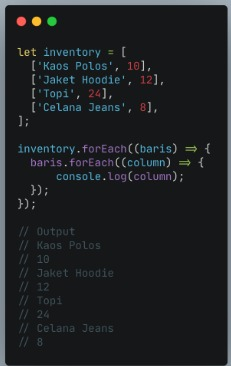

# Multidimensional Array  

  

  

>tampilan web page console.log  

>Bayangkan multidimensional ini seperti Table. Baris pada table itu menunjukan jumlah array. Column pada table itu menunjukan isi dari tiap array.  

  

 

**Akses index multidimensional array**  

  

Sama seperti array satu dimensi, multidimensional array juga dapat menggunakan Property dan Method built-in Array.  

  

  

**Operation using map in multidimensional array**  

  

  

>tampilan di console.log  

   

**Looping for Multidimensional Array**  

   

   

>Using For Loop

   

>Tampilan pada Web Page