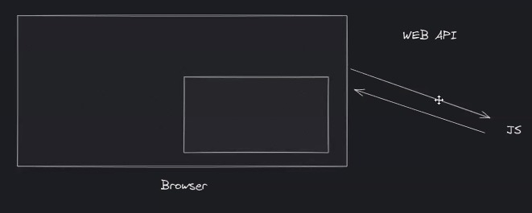
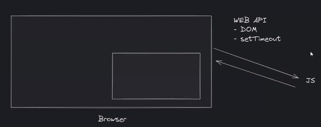

# Web Storge  
Browser punya penyimpanannya sendiri  

Web storge : peyimpanan browser kita.  
Data dr apk website bisa disimpan di browsernya user.  

Cookie : tempat nyimpan data juga, selain web storage.  

Sblm html 5 yg digunakan nyimpan data adalah cookie.  
Web storge muncul html 5.  

   

Memanipulasi web browser dengan js dengan web API  

   

>web API membuat jdi user terkoneksi dengan web  

   

>Web API : Jembatan yg dibuat browser , siapa saja bisa mengakses browser